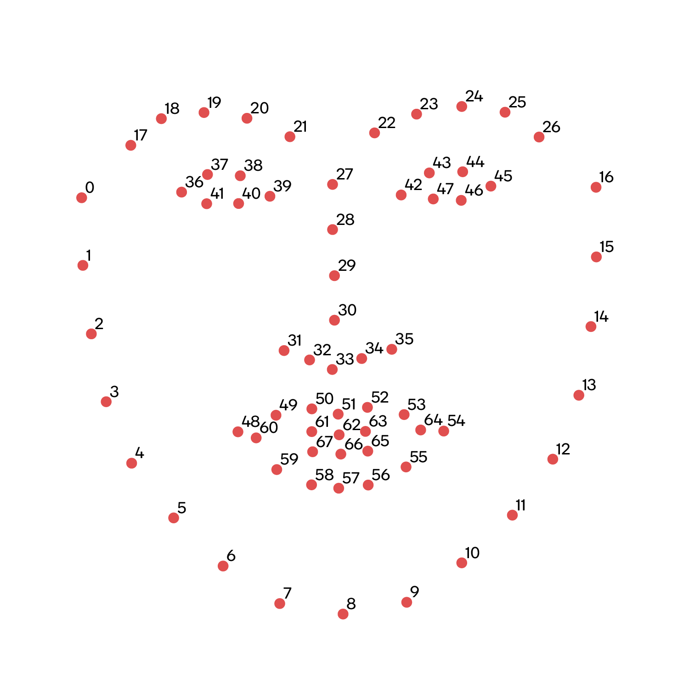

**Requirements**

**Introduction**

- With the fast development in computer vision area, more and more research works and industry applications are focused on facial keypoints detection.
- Facial keypoints are the vital areas in the face from which a person’s facial expressions — and, therefore, emotions — can be evaluated. 
- They play an important role in developing real-time applications for detecting drowsiness, analysing biometrics and reading a person’s emotions.                                                         

**Research**

- In field of computer vision research, one of the most important branch is Face recognition. It’s target is to verifying the identity of an individual using their face. 
- For the purpose of developing an advanced face recognition algorithm, Detection of facial key points is the basic and very important task, basically it is about finding out the location of specific key points on facial images. 
- These key points can be mouth, noses, left eyes, right eyes and so on.
- Recognizing facial key points is a difficult to solve. Facial characteristics differ significantly from one person to the next, and even within a single person, there is a lot of variances owing to 3D posture, size, location, viewing angle, and lighting circumstances. 
- Facial key points can be used in a variety of machine learning applications from face and emotion recognition to commercial applications like the image filters popularized by Snapchat.
- Facial keypoints (also called facial landmarks) are the small dots shown on each of the faces in the Web camera. While testing the image through a webcam, there will be  a 68 keypoints, with coordinates (x, y), for that face. These keypoints mark important areas of the face: the eyes, corners of the mouth, the nose, etc. 
- In the below image, these keypoints are numbered, and you can see that specific ranges of points match different portions of the face.

`                                                                                                                                                    `

**Cost and Features**

**Cost**

- If there is an internal enabled webcam attached to your laptop / PC, then it’s free of cost.
- But, if there is no internal enabled webcam, we have to buy an external device to access it. 

**Features**

The features of Face detection are:

1. Quick to compute.
- Classification of a face does not require a lot of offline processing.
1. Accurate.
- Through webcam it can provide accuracy above the 90%

**Defining the System**

**SWOT Analysis**

**4W's and 1'H**

**Who:**

It is helpful for the detecting the faces in real-time for tracking of a person through surveillance or Webcam.

**What:**

The primary aim of face detection is to detect the location of the keypoints on face Images.

**When:**

- Facial keypoints detection can be used in various applications like tracking the faces in video or images, analysing facial expressions, biometrics/facial recognition.

**Where:**

- It is being used by Snapchat, Instagram to attract people with their face filters.
- It can be used for tacking people who had done any uncertain things

**How:**

Face Detection works as to detect multiple faces in an image. 

Steps that show how face detection and facial Keypoints Detection works:

1. We have to check whether the face is detecting through the webcam or not. For this, we are using Step 2.
1. The picture in the video is transformed from RGB to Grayscale because it is easy to detect faces in grayscale.
1. Image Segmentation which is used for counter detection or segment the multiple objects in a single image so that the model used can easily or quickly detect the faces in the video.
1. We use dlib.get\_frontal\_face\_detector () to detect whether the face is in the webcam video or not . dlib.shape\_predictor() is a tool that takes in an image region containing some object and outputs a set of point locations that define the pose of the object. Here we use the **shape\_predictor\_68\_face\_landmarks.dat** model to create the predictor object. We then pass the frame and detect the rectangular dimensions.
1. We then can detect the facial keypoints using the landmark points which range from 0 to 68 : 
   - 0 – 26  -  Face Outline from Eyebrows
   - 27 – 35 – Nose
   - 36 – 41 – Right Eye
   - 42 – 47 – Left Eye
   - 48 – 68 – Mouth
1. The next Step is to give the coordinates of x1, x2, y1, y2 which makes a circle in the video to show the keypoints of the face.
1. Finally, If there is a face in the video opened via webcam then the rectangular box which detects whether the face is present or not and the circular keypoints around the face.

