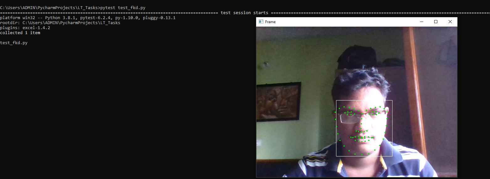
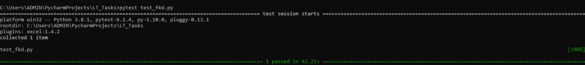

# Test Cases

    Tested whether the program executed for detecting the face and facial Keypoints or not.It succesfully passed the testcase.
## Testing Output

### Output 1

### Output 2

### Final (Testcase Passed)

