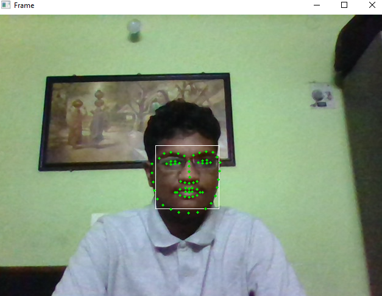

# Output

    - This project main aim is to detect the face and facial keypoints using Webcam.
    - The keypoints range from 0 to 68 :
    
        1. 0 – 26  - Face Outline from Eyebrows
        2. 27 – 35 – Nose
        3. 36 – 41 – Right Eye
        4. 42 – 47 – Left Eye
        5. 48 – 68 – Mouth
# Output Image

